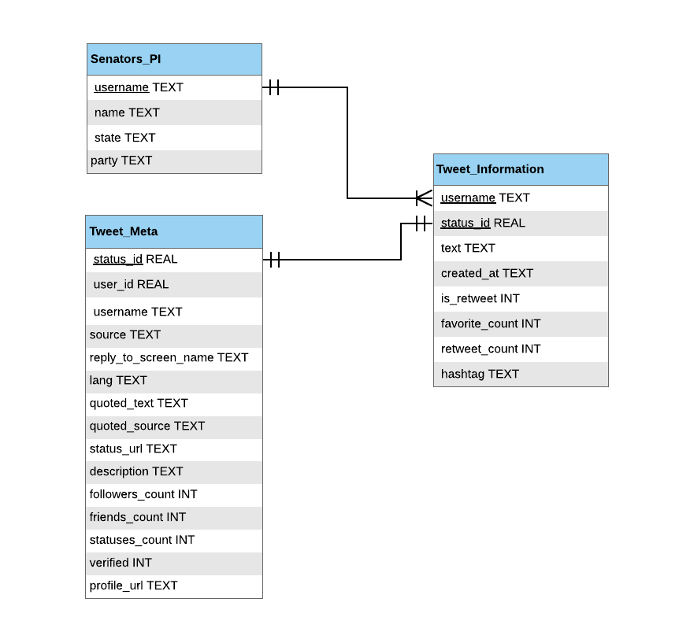

\clearpage

### Problem Description:

In 2019, social media, as a tool of communication for government authorities, has become commonplace. Take America’s current president, Donald Trump, who has a very active Twitter account with almost 60 million followers and over 41,000 tweets. The way Trump expresses himself online has been a very controversial subject, as his inflammatory vocabulary has often times promoted hostile behaviour. It’s not out of the norm for officials to have Twitter, Facebook, and Instagram accounts. In fact, it can play an important role in their jobs and public opinion. Take the research of Jonathan Bright and his team at the Oxford Internet Institute in the U.K on the recent parliament elections (May 2015 and June 2017). They found that “MPs that had a Twitter account typically had vote shares around 7- 9% higher than those who did not”, which could turn out to be incredibly decisive as around 14% of the electoral competitions involved in the study where won by a margin of less than 5% (MIT Technology Review, 2019). Bright concludes that “overall the evidence suggests social media use makes a genuinely important difference to electoral campaigns.” The use of Twitter can have a significant impact on the public view of a government official, as it makes communication more accessible but also informal. We want to analyze the way government officials communicate with their constituents on this more informal platform: what kind of sentiment are they putting out there and how are they discussing current topics?

### Rationale for Data Selection
 
As previously stated, our primary source we used for data collection was Twitter. Because we wanted to gain a better understanding of the important political topics being discussed and the sentiment around them, we decided to narrow the scope of the project to focus on the current United States Senators of the 116th Congress. The US Senate is composed of senators, each of whom represents a single state in its entirety. Each state, regardless of its population size, is equally represented by two senators. We also chose to focus on their Twitter accounts because this provides us with an easily measurable and accessible way to understanding: what topics they discuss with the public, their sentiment around those topics, and how they engage with other users online.
The three primary sources of data used for our project include: Twitter handles (usernames) for all 100 senators, tweets for all 100 senators, each senator’s political party, and the state that each senator represents. In order to gain access to the senators’ tweets, it was crucial that we had a standardized way of obtaining the usernames corresponding to their Twitter profiles. We began with scraping their Twitter usernames online. Once we had their usernames we were able to use rtweet to retrieve their most recent 80 tweets from the month of March. We further scraped the political party and state of each representative. We felt that political party and state were two crucial attributes that would help us further segment the sentiment around trending topics.

### Justification for Processes 

For this project, our group decided to use the Rtweet and SelectorGadget as the main tools to aid in data retrieval. We used rtweet to gather tweets from all the senators. It is an accessible and effective tool that uses access tokens granted by Twitter. With SelectorGadget we gathered complementary data for the senators such as their affiliated political parties. Using this tool, we were able to scrape names and parties and join them with the names that we already had. Since we did not want to re-run the calls to retrieve data from Twitter, we stored the data in a SQLite database. This would ensure that all the data would be easily accessible through SQL queries. For the sentiment analysis, we decided to use the tidytext package. We found that tidytext was a great use for this project since it contained a sentiments dataset. We ran the words used in tweets against the sentiments dataset using the “nrc”, “bing”, and “afinn” lexicon. Each lexicon was used for different types of analysis which will be discussed later on in the report. Combining tidytext with ggplot was an efficient way to visually analyze the tweets. Finally, for project management, we used Github/Git as a way to version control and share the code. 


Libraries
```{r setup, include=FALSE}
knitr::opts_chunk$set(echo = TRUE)
library(tidyverse)
library(tidytext)
library(wordcloud)
library(stm)
library(rquery)
library(reshape2)
library(ggrepel)
```

## Part 1. Data Collection

### Establishing a connection with the Twitter API
```{r include=FALSE}
knitr::opts_chunk$set(echo = TRUE)

access_token_secret <- "uTBqRxTxq5X1ir08qfxmOPBnkzMcSaLoHwEMMsEX7UO7N" #replace with your access token secret
consumer_key       <- "9gA8Qke0e1LMXsKMXNo1Ws5jN" #replace with your key
consumer_secret    <- "w1V5GWji8roYcnTrfpBFhEFqmjuaU56i6xDINFUisU0t3ftBje" #replace with your secret
access_token       <- "342952076-IAH8xQctBhdm0E4duIjdTGO04ooVQzv8W4FAsr0S" #replace with your access token
appname <- "DS4100_App"


# create token named "twitter_token"
twitter_token <- rtweet::create_token(app = appname,
                                      consumer_key = consumer_key,
                                      consumer_secret = consumer_secret,
                                      access_token = access_token,
                                      access_secret = access_token_secret)
```

### Segment Senators for Tweet Collection
```{r}
# We segmented the 100 senators into groups for data collection
load("senatorDataDF.Rda")
beg_senators_1 <- senatorsdf[c(1:8),]
beg_senators_2 <- senatorsdf[c(9:16),]
beg_senators_3 <- senatorsdf[c(17:24),]
beg_senators_4 <- senatorsdf[c(25:33),]
mid_senators_1 <- senatorsdf[c(34:42),]
mid_senators_2 <- senatorsdf[c(43:51),]
mid_senators_3 <- senatorsdf[c(52:60),]
mid_senators_4 <- senatorsdf[c(61:66),]
end_senators_1 <- senatorsdf[c(67:75),]
end_senators_2 <- senatorsdf[c(76:83),]
end_senators_3 <- senatorsdf[c(84:91),]
end_senators_4 <- senatorsdf[c(92:100),]
```

This code uses get_timeline() from the rtweet package to retrieve 80 of the latest tweets from the given list of Twitter handles. The results are saved to a single dataframe and then moved to an SQLite database. It is commmented out because we saved the data with a data dumb as a .Rda file which will be loaded below.

```{r}
# This is an example of how get_timeline was utilized
#tweets_beg_1 <- get_timeline(beg_senators_1$twitter, n = 80, max_id = NULL, home = FALSE, parse = TRUE, check = TRUE, token = NULL)
#tweets_beg_2 <- get_timeline(beg_senators_2$twitter, n = 80, max_id = NULL, home = FALSE, parse = TRUE, check = TRUE, token = NULL)
#tweets_beg_3 <- get_timeline(beg_senators_3$twitter, n = 80, max_id = NULL, home = FALSE, parse = TRUE, check = TRUE, token = NULL)
#tweets_beg_4 <- get_timeline(beg_senators_4$twitter, n = 80, max_id = NULL, home = FALSE, parse = TRUE, check = TRUE, token = NULL)

# Information from twitter was combined
#tweets_beg_all <- rbind(tweets_beg_1, tweets_beg_2)
#tweets_beg_all <- rbind(tweets_beg_all, tweets_beg_3)
#tweets_beg_all <- rbind(tweets_beg_all, tweets_beg_4)

# Finally, tweet information was saved as a .Rda file
# save(tweets_beg_all, file="tweetsBegAll.Rda")
```


### Loading data pulled using the rtweet API
```{r}
load("tweetsMidAll.Rda")
load("tweetsEndAll.Rda")
load("tweetsBegAll.Rda")
```
We aimed for all members of our group to become familiar with the rtweet API. We split the 100 senators among the three of us to obtain the data. This allowed us to minimize time spent obtaining the data and allowed for more efficient data collection. We each created a dataframe and saved it as a .Rda object. The code above loads the dataframes that we individually created.

### Combine all tweets into one dataframe
```{r merging data}
all_tweets <- rbind(tweets_beg_all, tweets_mid_all, tweets_end_all)
```

## Part 2. Data Cleaning

### Create the senator personal information tibble
```{r personal information tibble}

# Code used to get Senator party information
# webpage <- read_html("https://en.wikipedia.org/wiki/List_of_members_of_the_United_States_Senate")
# senators_party <- webpage %>%
# html_node("#senators") %>%
# html_table(fill = T) %>% select(Name, Party)

senator_parties <- read_csv("senators_party_tidy.csv")

load("senatorDataDF.Rda")
senator_personal_information_df <- as.data.frame(senatorsdf)
head(senator_personal_information_df)

senator_rename <- c("State", "Name", "Username")
colnames(senator_personal_information_df) <- senator_rename
senator_personal_information_df$Name <- gsub("Time Kaine N/A", "Tim Kaine", senator_personal_information_df$Name)

senator_personal_information_df <- inner_join(senator_parties, senator_personal_information_df)

```


### Create the tweet information tibble
```{r tweet info tibble}
tweet_information <- all_tweets %>% select(screen_name, 
                                           status_id, 
                                           text, 
                                           created_at, 
                                           is_retweet, 
                                           favorite_count, 
                                           retweet_count, 
                                           hashtags)
# cleaning up is_retweet, hashtags column, and dates
tweet_information$is_retweet <- as.integer(as.logical(tweet_information$is_retweet))
getHashTags <- function(x) {
  paste(unlist(x), collapse=' ')
}
result <- lapply(tweet_information$hashtags, getHashTags)
result <- unlist(result)

tweet_information$hashtags <- result

tweet_information$created_at <- as.character(tweet_information$created_at)

tweet_information_df <- data.frame(tweet_information)

tweet_information_names <- c("Username", 
                             "Status_Id",  
                             "Text", 
                             "Created_at", 
                             "Is_Retweet",
                             "Favorite_count", 
                             "Retweet_count", 
                             "Hashtag")
colnames(tweet_information_df) <- tweet_information_names

```


### Create the tweet meta data tibble
```{r meta data tibble}
tweet_meta <- all_tweets %>% select(user_id,
                                    status_id,
                                    screen_name,
                                    source,
                                    reply_to_screen_name,
                                    lang,
                                    quoted_text,
                                    quoted_source,
                                    status_url,
                                    description,
                                    followers_count,
                                    friends_count,
                                    statuses_count,
                                    verified,
                                    profile_url)

# cleaning up verified column

tweet_meta$verified <- as.integer(as.logical(tweet_meta$verified))

tweet_meta_df <- data.frame(tweet_meta)

tweet_meta_df_names <- c("UserId", "Status_Id", "Username" , "Source", "Reply_to_screen_name", "Lang",
            "Quoted_text", "Quoted_source", "Status_url","Description", "Followers_count", "Friends_count",
            "Statuses_count", "Verified", "Profile_url")
colnames(tweet_meta_df) <- tweet_meta_df_names
```

## Part 3. Exploratory Data Analysis

### Senator Details for Number of Followers, Avg Retweets, and Avg Favorites
```{r}
# Average number of retweets/favorites per tweet
info1 <- tweet_information_df %>% group_by(Username) %>% summarize(avgretweets = mean(Retweet_count),
                                                          avgfavorites = mean(Favorite_count))
# Number of followers
info2 <- tweet_meta_df %>% group_by(Username) %>% summarise(numfollowers = max(Followers_count))
info2

activityindexvaluesdf <- inner_join(info1, info2, by="Username")
head(activityindexvaluesdf)
```

### Relationship between number of followers and average retweets per tweet
```{r}
ggplot(activityindexvaluesdf, aes(x=numfollowers, y=avgretweets)) + 
  geom_point() +
  geom_smooth() + 
  labs(title="Number of followers vs. Average Retweets")
```

### Relationship between number of followers and average favorites per tweet
```{r}
ggplot(activityindexvaluesdf, aes(x=numfollowers, y=avgfavorites)) + 
  geom_point() +
  geom_smooth() + 
  labs(title="Number of followers vs. Average Favorites")
```
```{r}
ggplot(activityindexvaluesdf, aes(x=avgretweets, y=avgfavorites)) + 
  geom_point() +
  geom_smooth() + 
  labs(title="Average Favorites vs. Average Retweets")
```

As displayed above, the relationship between a Senator's average favorites and average retweets is stronger than the relationship between reweets/favorites and their number of followers. Because we would like to measure a Senator's engagement on the social media platform, average retweets and average favorites will be weighted higher in calculating their scores.

We will also normalize the data using mix/max normalization - by mapping all values between 0 and 1. This will allow for standardized comparisons.

### Calculating the Activity Index
```{r}
normalize <- function(x) {
    ((x - min(x)) / (max(x) - min(x)))
}

# First, normalize the the date
activityindexvaluesdf[2:4] <- as.data.frame(lapply(activityindexvaluesdf[2:4], normalize))

activityindexdf <- activityindexvaluesdf %>% group_by(Username) %>% summarise(activityindex = sum((.375*avgretweets),
                                                                             (.375*avgfavorites),
                                                                             (.25*numfollowers)))
activityindexdf %>% arrange(desc(activityindex))
```
A Senator's activity index is calculated by observing three factors of their online twitter presence. 25% of their score is comprised of the number of followers for that senator. 37.5% is calculated by their average number of rewteets per tweet and 37.5% is comprised of the average number of favorites they receive per tweet.

After retrieving the tweet data, we wanted to develop an activity level rating with which we can classify and rank how active each senator was over the last month. We identified the potentially most important characteristics for this rating to be a Senators: number of followers, average retweets per tweet, and average favorites per tweet. In order to understand the relationship between these factors, we began exploratory analysis.
As displayed above, the relationship between a Senator’s number of followers and the average retweets/favorites they receive is not a strong positive correlation. On the other hand, we did find that tweets that have high engagement with the public tend to receive a high number of retweets and favorites. Retweets involve a user to reshare the tweet to their timeline and share with their friends - thus, this is a higher level of engagement than clicking favorite.

### So who are the most active senators?
```{r}
activityindexdf %>% arrange(desc(activityindex))

activityindexdf %>% top_n(10) %>%
  ggplot() + 
  geom_point(fill="lightsalmon2", size=5, shape=21) + 
  aes(x= Username, y=activityindex) + 
  coord_flip() + 
  labs(title="Top 10 Most Active Senators")
```

A Senators activity level rating for the month of March aims to measure their engagement with the public. It is derived from their average number of retweets/favorites per tweet and retweets is weighted higher than favorites.
As displayed above, we first calculated the activity level for each Senator. Next we normalized their values using min max normalization so every value falls between 0 and 1. This allows for efficient comparison between values. Next, we arranged the list of Senators by their activity rating in descending order. As you can see, the most active Senators on Twitter who were most engaged with the public during this period are: Bernie Sanders, Chuck Schumer, Lindsey Graham, Rand Paul, Leader McConnell, and Elizabeth Warren. The activity level of each Senator will be recorded as an attribute in the Senator personal information table which will be described later in the report.


### Adding Activity Index to the Senator Personal Information Dataframe
```{r}
if(!("activityindex" %in% colnames(senator_personal_information_df)))
   {
  senator_personal_information_df <- left_join(senator_personal_information_df, activityindexdf, by="Username")
  }

senator_personal_information_df$X1 <- NULL
```


## Part 4. Database Creation

ERD 
```{r pressure, echo=FALSE, fig.cap="Visual Represenation of Database", out.width = '100%'}

```

### Creating the EAAP (Emotional Analysis of American Politics) Database
```{r database}
fn <- "eaap.sqlite"
#Check its existence
if (file.exists(fn)) {
  #Delete file if it exists
  file.remove(fn) 
}

library("RSQLite")
db<-dbConnect(SQLite(),dbname="eaap.sqlite")
summary(db)

# Create Senator table 
dbSendQuery(conn=db, "CREATE TABLE IF NOT EXISTS Senators_PI ( 
            Name TEXT,
            Party TEXT,
            State TEXT,
            Username TEXT PRIMARY KEY,
            activityindex REAL)")
dbWriteTable(conn = db, name = "Senators_PI", value = senator_personal_information_df, row.names = F, append = T)
#dbReadTable(db, "Senators_PI")

# Create Tweet table 
dbSendQuery(conn=db, "CREATE TABLE IF NOT EXISTS Tweets (Username TEXT, 
            Status_Id TEXT, 
            Text TEXT,
            Created_at TEXT,
            Is_Retweet INTEGER,
            Favorite_count INTEGER, 
            Retweet_count INTEGER,
            Hashtag TEXT, 
            PRIMARY KEY (Username, Status_Id))")
dbWriteTable(conn = db, name = "Tweets", value = tweet_information_df, row.names = F, append = T)
#dbReadTable(db, "Tweets")

# Additional data
dbSendQuery(conn=db, "CREATE TABLE IF NOT EXISTS Tweet_Metadata (UserID INTEGER,
            Status_Id TEXT PRIMARY KEY, 
            Username TEXT, 
            Source TEXT,
            Reply_to_screen_name TEXT,
            Lang TEXT,
            Quoted_text TEXT,
            Quoted_source TEXT,
            Status_url TEXT,
            Description TEXT, 
            Followers_count INTEGER,
            Friends_count INTEGER,
            Statuses_count INTEGER, 
            Verified INT,
            Profile_url TEXT)")
dbWriteTable(conn = db, name = "Tweet_Metadata", value = tweet_meta_df, row.names = F, append = T)
#dbReadTable(db, "Tweet_Metadata")

#dbListTables(db)

```

To create the database, we wanted to keep it simple but also maintain any extra information that might be useful for analysis later on. First, we created a Senators_PI table that holds a senator’s personal information (name, state they represent, their party and their Twitter username). Then, we have a Tweets table which holds the basic information of a Tweet (username of the person who tweeted it, favorite / retweet count, and so on). This relationship is a one-to-many (a senator has many tweets but a tweet only has one senator). Finally, we have the Tweet_Metadata table where we added all the extra Tweet information that wasn’t necessary for our base goals. This has a one-to-one relationship where every Tweet has one Metadata and vice versa. 


## Part 5. Data Analysis

### Word Cloud
```{r wordcloud}

all_tweets <- dbGetQuery(db, "SELECT Text FROM Tweets")


tweet_text <- tibble(text = all_tweets$Text)

fillerwords <- c("t.co", "https", "amp", "1", "2", "it's")
fillerwordstable <- tibble("word" = fillerwords)

tweet_text %>%
  unnest_tokens(word, text) %>%
  group_by(word) %>% summarize(count = n()) %>%
  anti_join(stop_words) %>% # removing stop words
  anti_join(fillerwordstable, by = "word") %>%
  with(wordcloud(word, count, use.r.layout=FALSE, max.words = 150, random.order = FALSE, 
                 colors = brewer.pal(6, "Dark2"), scale=c(3,.1)))
```

After creating our database, we retrieved all the tweets collected to explore the content in the form of a wordcloud utilizing the wordcloud library. First, we removed the stop works (things such as like or as) and unwanted words (things such as https or numbers). This allowed us to learn some of the most popular words appearing among all Senators tweets. The frequency of words is denoted by color and position. Each color represents a layer and the most frequent words are closer to the center of the wordcloud. The most popular words include: Senate, act, people, health, bill, president, national, women, etc.


### General Sentiment Analysis
```{r}
nrc = sentiments %>% filter(lexicon=="nrc")
bing = sentiments %>% filter(lexicon=="bing")

wordCounts <- tweet_text %>%
  unnest_tokens(word, text) %>%
  group_by(word) %>% 
  summarize(count=n())

wordCounts %>% 
  inner_join(nrc) %>%
  group_by(sentiment) %>%
  summarize(score = sum(count)) %>%
  mutate(share = score/sum(score) * 100) %>%
  ggplot(aes(x=sentiment, y=share, fill = sentiment)) +
  geom_bar(stat="identity") + 
  labs(title="Sentiment in US Senator Tweets", subtitle="Sentiment as share of sentiment words from last month's tweets.")

wordCounts %>% 
  inner_join(bing) %>%
  group_by(sentiment) %>%
  summarize(score = sum(count)) %>%
  mutate(share = score/sum(score) * 100) %>%
  ggplot(aes(x=sentiment, y=share, fill = sentiment)) +
  geom_bar(stat="identity") + 
  labs(title="Sentiment in US Senator Tweets", subtitle="Positive and negative sentiment as share of sentiment words from last month's tweets.")
```

The sentiment analysis packages we used for this project include the bing and nrc lexicons. The tidytext package in R contains these lexicons in the sentiments dataset. These lexicons are based on unigrams (i.e. single words). Each word is assigned a score for positive/negative sentiment and emotions like joy, anger, sadness and so forth. Above, we explored the general sentiment of all tweets using the bing and nrc lexicons. Sentiments are displayed as a share of sentiment words out of 100% (Julia Silge, 2019).


### ngrams
```{r}
fillerwords <- c("t.co", "https", "amp")
fillerwordstable <- tibble("word" = fillerwords)

tweet_text %>%
  unnest_tokens(word,text,token="ngrams",n=4) %>%
  group_by(word) %>%
  filter(n()>35) %>%
  ggplot() + 
  geom_bar(fill="lightsalmon2") + 
  aes(x=word) + 
  coord_flip() + 
  labs(title="NGram for all Tweets", subtitle="n=4")

tweet_text %>%
  unnest_tokens(word,text,token="ngrams",n=5) %>%
  group_by(word) %>%
  filter(n()>12) %>%
  ggplot() + 
  geom_bar(fill="cyan3") + 
  aes(x=word) + 
  coord_flip() + 
  labs(title="NGram for all Tweets", subtitle="n=5")

tweet_text %>%
  unnest_tokens(word,text,token="ngrams",n=3) %>%
  group_by(word) %>%
  filter(n()>100) %>%
  ggplot() + 
  geom_bar(fill="darkorchid") + 
  aes(x=word) + 
  coord_flip() + 
  labs(title="NGram for all Tweets", subtitle="n=3")
```

As displayed above, we used nGrams to explore groupings of words greater than one that occur most frequently. With n=4, we found that “the green new deal” and “the affordable care act” are topics being discussed over the month of March. We also found that Senators frequently share links to photos, videos, and articles.


### Hashtag Analysis
```{r}
all_hashtags <- dbGetQuery(db, "SELECT Hashtag FROM Tweets")

hashtags <- tibble(text = all_hashtags$Hashtag)

hashtagCounts <- hashtags %>%
  unnest_tokens(word, text) %>%
  group_by(word) %>% summarize(count = n()) %>%
  anti_join(stop_words) %>%# removing stop words
  arrange(desc(count)) %>%
  filter(word != "na")

top10 <- top_n(hashtagCounts, 10)

hashtagCounts

top10 %>% 
  ggplot() + 
  geom_bar(fill="darkolivegreen4", aes(x=word, y=count),stat="identity") + 
  coord_flip()


hashtagCounts %>%
  with(wordcloud(word, count, use.r.layout=FALSE, max.words = 150, random.order = FALSE, 
                 colors = brewer.pal(8, "Dark2"), scale=c(3,.4)))
```

After an initial exploration and understanding of the tweets we collected, we believed it would be insightful to find the top trending hashtags of the time period. In addition to viewing the distribution of hashtags in a histogram, we created a wordcloud and found that the top topics and trends being discussed were GreenNewDeal and WomensHistoryMonth. We plan to focus on these events for further analysis. 

### Distribution of Tweets: Based on the date that they were created.
```{r}
all_dates <- dbGetQuery(db, "SELECT Created_at  
                      FROM Tweets")

dates <- as.Date(all_dates$Created_at)

ggplot(all_tweets, aes(dates)) +
  geom_histogram(color="cyan4", fill="cyan4") + 
  labs(title="Distribution of Tweets")
```

This shows where the distribution of the dates for the tweets. We can see that there are tweets before March, these corresponds to the senators who are not as active on their accounts. However, there are not a significant amount.

### Green New Deal Hashtag Analysis
```{r}
#Query database for tweets using #GreenNewDeal
gnd <- dbGetQuery(db, "SELECT t.Username, Text, State, Hashtag, Party FROM Tweets t INNER JOIN Senators_PI s ON t.Username = s.Username WHERE Hashtag LIKE '%GreenNewDeal%'")

#Place the results of the query in a tibble
gnd_tibble <- tibble(text = gnd$Text, state = gnd$State, party = gnd$Party)

#Unnest words from text and group them by state, party, then word
gndSentiment <- gnd_tibble %>% 
  unnest_tokens(word, text) %>%
  group_by(state, party, word) %>%
  summarize(count=n())

#Use NRC lexicon (tidytext) to gather overall sentiment of tweets and plot using ggplot
gndSentiment %>% 
  inner_join(nrc) %>%
  group_by(sentiment) %>%
  summarize(score = sum(count)) %>%
  mutate(share = score/sum(score) * 100) %>%
  ggplot(aes(x=sentiment, y=share, fill = sentiment)) +
  geom_bar(stat="identity") + 
  labs(title="Sentiment on Green New Deal", subtitle="Overall sentiment analysis using the nrc lexicon on tweets using #GreenNewDeal")

#Use NRC lexicon (tidytext) to gather sentiment of tweets by party and plot using ggplot
gndSentiment %>% 
  inner_join(nrc) %>%
  group_by(party, sentiment) %>%
  summarize(score = sum(count)) %>%
  mutate(share = score/sum(score) * 100) %>%
  ggplot(aes(x=sentiment, y=share, fill = party)) +
  geom_bar(stat="identity") + 
  labs(title="Party Sentiment on Green New Deal", subtitle="Sentiment analysis by party using the nrc lexicon on tweets using #GreenNewDeal")

#Use NRC lexicon (tidytext) to gather sentiment of tweets by state and plot using ggplot
gndSentiment %>% 
  inner_join(nrc) %>%
  group_by(state, sentiment) %>%
  summarize(score = sum(count)) %>%
  mutate(share = score/sum(score) * 100) %>%
  ggplot(aes(x=state, y=share, fill = sentiment)) +
  geom_bar(stat="identity") + 
  labs(title="State Sentiment on Green New Deal", subtitle="Sentiment analysis by state using the nrc lexicon on tweets using #GreenNewDeal")

#Use bing lexicon (tidytext) to gather overall sentiment of tweets and plot using ggplot
gndSentiment %>% 
  inner_join(bing) %>%
  group_by(sentiment) %>%
  summarize(score = sum(count)) %>%
  mutate(share = score/sum(score) * 100) %>%
  ggplot(aes(x=sentiment, y=share, fill = sentiment)) +
  geom_bar(stat="identity") + 
  labs(title="Sentiment on Green New Deal", subtitle="Overall positive/negative sentiment analysis using the bing lexicon on tweets using #GreenNewDeal")

#Use bing lexicon (tidytext) to gather sentiment of tweets by state
gndSentimentStateAnalysis <- gndSentiment %>% 
  inner_join(bing) %>%
  group_by(state, sentiment) %>%
  summarize(score = sum(count)) %>%
  mutate(share = score/sum(score) * 100)

#Plot using ggplot
gndSentimentStateAnalysis %>%
  ggplot(aes(x=state, y=share, fill = sentiment)) +
  geom_bar(stat="identity") + 
  labs(title="State Sentiment on Green New Deal", subtitle="Positive/negative sentiment analysis by state using the bing lexicon on tweets using #GreenNewDeal")

#Use bing lexicon (tidytext) to gather sentiment of tweets by party
gndSentimentPartyAnalysis <- gndSentiment %>%
  inner_join(bing) %>%
  group_by(party, sentiment) %>%
  summarize(score = sum(count)) %>%
  mutate(share = score/sum(score) * 100)

#Plot using ggplot
gndSentimentPartyAnalysis %>%
  ggplot(aes(x=party, y=share, fill = sentiment)) +
  geom_bar(stat="identity") + 
  labs(title="Party Sentiment on Green New Deal", subtitle="Positive/negative sentiment analysis by party using the bing lexicon on tweets using #GreenNewDeal")


```

Using the hashtag analysis, we saw that Green New Deal was the popular. We decided to see how the different senators were tweeting about the topic. First, we queried the database to retrieve all the tweets using #GreenNewDeal including the handle that wrote the tweet, the state the senator is from, the senator’s political party, and the text of the tweet. 
Using the Tidytext package, we used the nrc lexicon to gather insight on the overall sentiment for all the tweets. We found that most of the tweets seem to have a positive and trust sentiment. We then decided to analyze by party, we were surprised to find that sentiments were pretty equal for both the Democratic and Republican parties. Next, we analyzed sentiments about the Green New Deal by state, the data points that did stand out were Nebraska tweets showed more fear and there was an absence of both trust and anger in Pennsylvania.
We also decided to use the bing lexicon which organizes the text into either positive or negative categories. We first ran an overall sentiment analysis over all the tweets and were surprised to find that negative tweets were higher than positive tweets which was the opposite in the nrc lexicon analysis. We realized that the distribution of the negative categories for the nrc lexicon were more spread out than the positive categories. Next, we grouped the tweets by state and found that most states had a fair share of positive and negatives tweets with the exception of a few states such as Missouri, Pennsylvania, Iowa, and South Carolina. Then, we grouped the tweets by party, and found that Republicans seemed to have more negative things to say about the Green New Deal. 


### Women's History Month
```{r}
#Query database for tweets using #WomensHistoryMonth
whm <- dbGetQuery(db, "SELECT t.Username, Text, State, Hashtag, Party FROM Tweets t INNER JOIN Senators_PI s ON t.Username = s.Username WHERE Hashtag LIKE '%WomensHistoryMonth%'")

#Place the results of the query in a tibble
whm_tibble <- tibble(text = whm$Text, state = whm$State, party = whm$Party)

#Unnest words from text and group them by state, party, then word
whmSentiment <- whm_tibble %>% 
  unnest_tokens(word, text) %>%
  group_by(state, party, word) %>%
  summarize(count=n())

#Use NRC lexicon (tidytext) to gather overall sentiment of tweets and plot using ggplot
whmSentiment %>% 
  inner_join(nrc) %>%
  group_by(sentiment) %>%
  summarize(score = sum(count)) %>%
  mutate(share = score/sum(score) * 100) %>%
  ggplot(aes(x=sentiment, y=share, fill = sentiment)) +
  geom_bar(stat="identity") + 
  labs(title="Sentiment on Women's History Month", subtitle="Overall sentiment analysis using the nrc lexicon on tweets using #WomensHistoryMonth")

#Use NRC lexicon (tidytext) to gather sentiment of tweets by party and plot using ggplot
whmSentiment %>% 
  inner_join(nrc) %>%
  group_by(party, sentiment) %>%
  summarize(score = sum(count)) %>%
  mutate(share = score/sum(score) * 100) %>%
  ggplot(aes(x=sentiment, y=share, fill = party)) +
  geom_bar(stat="identity") + 
  labs(title="Party Sentiment on Women's History Month", subtitle="Sentiment analysis by party using the nrc lexicon on tweets using #WomensHistoryMonth")

#Use NRC lexicon (tidytext) to gather sentiment of tweets by state and plot using ggplot
whmSentiment %>% 
  inner_join(nrc) %>%
  group_by(state, sentiment) %>%
  summarize(score = sum(count)) %>%
  mutate(share = score/sum(score) * 100) %>%
  ggplot(aes(x=state, y=share, fill = sentiment)) +
  geom_bar(stat="identity") + 
  labs(title="State Sentiment on Women's History Month", subtitle="Sentiment analysis by state using the nrc lexicon on tweets using #WomensHistoryMonth")

#Use bing lexicon (tidytext) to gather overall sentiment of tweets and plot using ggplot
whmSentiment %>% 
  inner_join(bing) %>%
  group_by(sentiment) %>%
  summarize(score = sum(count)) %>%
  mutate(share = score/sum(score) * 100) %>%
  ggplot(aes(x=sentiment, y=share, fill = sentiment)) +
  geom_bar(stat="identity") + 
  labs(title="Sentiment on Women's History Month", subtitle="Overall positive/negative sentiment analysis using the bing lexicon on tweets using #WomensHistoryMonth")

#Use bing lexicon (tidytext) to gather sentiment of tweets by state
whmSentimentStateAnalysis <- whmSentiment %>% 
  inner_join(bing) %>%
  group_by(state, sentiment) %>%
  summarize(score = sum(count)) %>%
  mutate(share = score/sum(score) * 100)

#Plot using ggplot
whmSentimentStateAnalysis %>%
  ggplot(aes(x=state, y=share, fill = sentiment)) +
  geom_bar(stat="identity") + 
  labs(title="State Sentiment on Women's History Month", subtitle="Overall positive/negative sentiment analysis by state using the bing lexicon on tweets using #WomensHistoryMonth")

#Use bing lexicon (tidytext) to gather sentiment of tweets by party
whmSentimentPartyAnalysis <- whmSentiment %>% 
  inner_join(bing) %>%
  group_by(party, sentiment) %>%
  summarize(score = sum(count)) %>%
  mutate(share = score/sum(score) * 100)

#Plot using ggplot
whmSentimentPartyAnalysis %>%
  ggplot(aes(x=party, y=share, fill = sentiment)) +
  geom_bar(stat="identity") + 
  labs(title="Party Sentiment on Women's History Month", subtitle="Overall positive/negative sentiment analysis by party using the bing lexicon on tweets using #WomensHistoryMonth")
```

Women’s History Month was the second most popular hashtag used and we decided it would be a great way to test the accuracy of the Tidytext package sentiment analysis since we anticipate that most tweets for this topic would be positive. Similar to the first hashtag analysis, we first queried the database to retrieve all the tweets using the Women’s History Month hashtag.
Using the nrc lexicon for overall sentiment analysis, the results were pretty close to what we expected. Most of the shares fell into categories with positive connotations. When we grouped the tweets by party, we found a pretty equal share for each category. There was also a fair distribution of categories among the states. These results were not as surprising since Women’s History Month is not a cause that politically motivated.
Using the bing lexicon, we found that most of the tweets had a positive sentiment. When grouping the tweets by state and party, we did not see any results that we would not expect. The sentiment analysis of the Women’s History Month hashtag solidified our confidence in the Tidytext package since it was able to return results that we were expecting.


### Find top 5 most popular tweets and compare against activity index
```{r}

# Gather data from table and filter out retweets because we are trying to find the top five most active original tweets. 
popular_tweets <- dbGetQuery(db, "SELECT Username, Text, Favorite_count, Retweet_count
                      FROM Tweets WHERE Is_Retweet = 0")

# Get top tweets based on favorite count
top_favCount <- popular_tweets[order(popular_tweets$Favorite_count,decreasing=T)[1:5],]

# Get top tweets based on retweet count
top_retweetCount <- popular_tweets[order(popular_tweets$Retweet_count,decreasing=T)[1:5],]

# Combine retweet and favorites count
popular_tweets$tweet_popularity <- popular_tweets$Retweet_count + popular_tweets$Favorite_count

# Get top tweets based on combined retweet and favorites count
top_popularityTweets <- popular_tweets[order(popular_tweets$tweet_popularity,decreasing=T)[1:5],]

senator_tweets <- dbGetQuery(db, "SELECT Name, Username, activityindex FROM Senators_PI")
topTweeters <- senator_tweets[order(senator_tweets$activityindex,decreasing=T)[1:5],]

# Find usernames that do not overlap between the top five most active tweets and the most active / popular Twitters
setdiff(top_popularityTweets$Username, topTweeters$Username)

```

We wanted to further gage the engagement and popularity of tweets versus Twitter accounts by finding the top five most popular tweets and comparing against the activity index. When we first gathered the tweets from the database, we filtered out retweets because we wanted to look at only original tweets. 
When we try to find the usernames that do not overlap between the top five most popular tweets and the most active / popular Twitters, we get Character[0] meaning that the accounts with the highest activity indexes have tweeted the most popular tweets. This further justifies our activity index as we can see that the top five tweets of the last month were tweeted by the five senators that our activity index establishes as the most active / popular Twitter accounts. 

### Sentiment analysis on the tweets of the most active Senators
```{r}
senators_and_activity <- dbGetQuery(db, "SELECT Username, activityindex FROM Senators_PI")
# Gettting the top five Senators based on activity level
senators_and_activity %>% arrange(desc(activityindex)) %>% top_n(5)

# Getting the top five most active Senator's tweets
sanders_tweets <- dbGetQuery(db, "SELECT Text FROM Tweets WHERE Username = 'SenSanders'")
schumers_tweets <- dbGetQuery(db, "SELECT Text FROM Tweets WHERE Username = 'SenSchumer'")
grahms_tweets <- dbGetQuery(db, "SELECT Text FROM Tweets WHERE Username = 'LindseyGrahamSC'")
pauls_tweets <- dbGetQuery(db, "SELECT Text FROM Tweets WHERE Username = 'RandPaul'")
warrens_tweets <- dbGetQuery(db, "SELECT Text FROM Tweets WHERE Username = 'SenWarren'")


# Bernie Sanders Sentiment Analysis
sanders_tweets <- tibble(text = sanders_tweets$Text)
sanders_WordCounts <- sanders_tweets %>%
  unnest_tokens(word, text) %>%
  group_by(word) %>% 
  summarize(count=n())

sanders_nrc <- sanders_WordCounts %>% 
  inner_join(nrc) %>%
  group_by(sentiment)

plot_words <- sanders_nrc %>%
  group_by(sentiment) %>%
  count(word, sort = TRUE) %>%
  arrange(desc(n)) %>%
  slice(seq_len(10)) %>%
  ungroup()

plot_words %>%
  ggplot(aes(word, 1, label = word, fill = sentiment )) +
  geom_point(color = "transparent") +
  geom_label_repel(force = 1,nudge_y = .5,  
                   direction = "y",
                   box.padding = 0.05,
                   segment.color = "transparent",
                   size = 3) +
  facet_grid(~sentiment) +
  theme(axis.text.y = element_blank(), axis.text.x = element_blank(),
        axis.title.x = element_text(size = 6),
        panel.grid = element_blank(), panel.background = element_blank(),
        panel.border = element_rect("lightgray", fill = NA),
        strip.text.x = element_text(size = 9)) +
  xlab(NULL) + ylab(NULL) +
  ggtitle("Bernie Sanders NRC Sentiment") +
  coord_flip()

# Lindsey Grahm Sentiment Analysis
grahms_tweets <- tibble(text = grahms_tweets$Text)
grahms_WordCounts <-grahms_tweets %>%
  unnest_tokens(word, text) %>%
  group_by(word) %>% 
  summarize(count=n())

grahms_nrc <- grahms_WordCounts %>% 
  inner_join(nrc) %>%
  group_by(sentiment)

plot_words2 <- grahms_nrc  %>%
  group_by(sentiment) %>%
  count(word, sort = TRUE) %>%
  arrange(desc(n)) %>%
  slice(seq_len(10)) %>%
  ungroup()

plot_words2 %>%
  ggplot(aes(word, 1, label = word, fill = sentiment )) +
  geom_point(color = "transparent") +
  geom_label_repel(force = 1,nudge_y = .5,  
                   direction = "y",
                   box.padding = 0.05,
                   segment.color = "transparent",
                   size = 3) +
  facet_grid(~sentiment) +
  theme(axis.text.y = element_blank(), axis.text.x = element_blank(),
        axis.title.x = element_text(size = 6),
        panel.grid = element_blank(), panel.background = element_blank(),
        panel.border = element_rect("lightgray", fill = NA),
        strip.text.x = element_text(size = 9)) +
  xlab(NULL) + ylab(NULL) +
  ggtitle("Lindsey Grahm NRC Sentiment") +
  coord_flip()
```

As displayed above, we retrieved the tweets from Senators with the top activity index. We used the nrc index to find the most common words used by Senator Sanders and Senator Graham that use the NRC lexicon. The words were placed into 8 emotional categories. We see powerful words appear among both senators. “Collusion” is a word that appears for Senator Graham across categories of anger and fear. Words such as “criminal, crazy, and assault” are negative words that appear within Senator Sanders tweets. His tweets also invoke emotions of trust with words like “collective and authority”.

### Issues we ran into and solutions

1. While we were retrieving tweets using the rtweet package, we discovered that there was a limit to the number of tweets that could be retrieved which is 18,000 tweets every 15 minutes. To resolve this issue, we decided to change the scope of the tweets we wanted. We initially planned on retrieving about six months’ worth of tweets which would approximately be 500 tweets per senator. We decided to narrow down to one month which would be approximately 80 tweets per senator. To further speed the process of gathering tweets, we split up the senators between the three group members. In the end, we each used our own access tokens to retrieve about 80 tweets from 33/34 senators. This limits out findings as having a smaller set of tweets limits the conclusions we can infer, like long-term patterns and trends. 

2. Another issue we ran into was different senators tweeting in different frequencies. So for example, the last 80 tweets for Senator A might be from the last two weeks but for Senator B they might be from the last 2 months. The reason we decided to keep all those tweets anyway was to be able to still get a good overview of an account’s overall sentiment equally among all senators. More importantly, the amount of tweets that were outliers in the sense that they dated to before March were very minimal and therefore, didn’t have that much impact on the analysis.

3. Finally, when we retrieved the Senator’s personal information, we were not able to get their Twitter username and party from the same source. We retrieved their parties from Wikipedia, which lists their name and party. From then on, it was a matter of performing an inner_join based on their names with the table that had their username and state. However, we ran into the issue of nicknames: in one table Senator Sanders was listed under Bernie and in another, listed as Bernard. We attempted to use Regex to clean up the data but this proved to cause more issues as we could not replace all Tom’s with Thomas because at times, Tom was both a nickname and an actual name (So not every Tom was a Thomas). Our solution for this was to replace the names by comparing the tables manually, 

### What we learned 

As a result of conducting our term project, we learned that senators across the board employ primarily positive sentiment as well as diction that expresses trust and anticipation. These three sentiments account for 53% share of all sentiment words used in their tweets. Senators seem to use their platform as a way to connect with their followers rather than speak negatively. Sentiment did not vary drastically among parties. For example, in regards the Green New Deal hashtag, the Republican senators’ tweets were slightly more negative (by 10%) than the Democratic senators’ tweets. 
We also learned that there are limitations to sentiment analysis. We found with the tidytext package we used we were restricted to bing, nrc and afinn lexicons. To enhance the field of sentiment analysis, these packages should be routinely updated to implement improvements based on feedback from experts or users. 

### Future work

For future work, we would aim to gather more information, obtaining more tweets over a longer period of time. This would allow us to analyze patterns and trends over months and years, which given how rapidly the use of Twitter by politicians is growing could lead to some interesting findings. This could also be used to conduct research like that of Jonathan Bright and his team, where we could attempt to predict success in elections based on Twitter activity/engagement. This could answer the question: are more engaged politicians more or less likely to become elected to office?

### References:
arXiv, Emerging Technology from the. “Can Political Tweets Win an Election? This Research Suggests They Can.” MIT Technology Review, MIT Technology Review, 26 Oct. 2017, www.technologyreview.com/s/609229/how-tweets-translate-into-votes/.

Silge, Julia, and David Robinson. “Text Mining with R.” 2 Sentiment Analysis with Tidy Data, 23 Mar. 2019, www.tidytextmining.com/sentiment.html.

